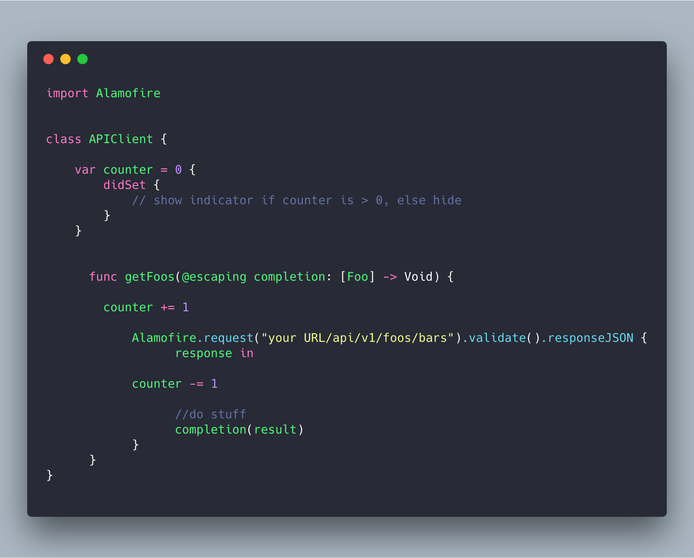

# The Life And Times of a Networking Client

---

# (Alt-cringe) Networking Client ki kahaani, Robin ki zubaani

^ Today, we're gonna look through the lifetime of a networking client in a general application. 

^ We're going to see how accidental complexity might seep into your app as it grows as a result of decisions you take early on in its lifecycle

^ This story is based on fact. Any similarity with fictitious events or characters was purely coincidental. No animals were harmed in the making of this presentation

---

^ I hope everyone has heard of incidental vs accidental complexity.

^ Soooo it's your first day at your job. You get to see what your app looks like. Project managers explain what it does, ideal personas you never understand. Designers show you amazing ideas and layouts that you'll never be able to make. You want to impress your coworkers with your cool new screens and so you get to work.

---

^ Now you need to talk to an API. No biggie, you just sprinkle a bunch of API calls into your View Controller. You can always fix this later, right? Plus, you have to ship an MVP yesterday. Move fast and break things, right?

^ So you google, and you decide to use Alamofire for networking. Everyone uses it, right? What could go wrong?

---

^ Okay, so far so good

^ But this makes your life a wee bit harder. There's lots of repetition. Your API URL is all over the place, you're parsing json the same way everywhere. Poori 4 saal ki CS degree yaad aati hain. Encapsulation, OOPS, SOLID cheekh cheekh ke bulaate hain. Zameer maanta nahi jab tak yeh code refactor nahi hoga

^ In english. But this makes your life a wee bit harder. There's lots of repetition. Your API URL is all over the place, you're parsing json the same way everywhere. 4 years of CS education calls out to you. Encapsulation, OOPS, SOLID can't leave your dreams. Your heart and soul won't rest till this code is refactored. THIS IS WHY YOURE A PROGRAMMER DAMNIT

---

^ So you sit down one day and decide to actually do that.

# ☕️

---

---

^ You put your networking code in a class, and everyone call into it everytime you need to. To further make things better, you decide you want to make a request builder/router/whatever to handle your URLs better

---

(image for representational purposes)

^ Awesome. Sooo now your API makes some changes. You have to send an auth token with every request. Later you find Alamofire has adapters to handle this problem better, and you use those. You have to manage state better cos there's a separate session manager object(tokens can change), but that's alright. Again, this is inherent complexity, right?

---

^ Onto your next feature where, surprise you're going to add a Network Activity Indicator. Sounds easy, right?

---

^ So you do the simple obvious thing, and add a counter to your client. Increment and decrement in ALL your requests. Sounds logical right? You add a counter, increment, decrement. Inherent complexity, riiiight? 

---

^ Now, tragedy strikes: some requests start failing for some reason. Standard Backend Frontend tu-tu main main ensues. You're told to add logging to your networking client. You make a logging function and add it to every networking call in your app. Inherent complexity, right?

---

^ Of course you later discover that this was a weird default setting in Alamofire, making you very, very sad.

---

^ Now, tragedy strikes again: there's an actual bug on the server, and to help triage it, you're asked to add logging for responses. You grit your teeth and do what you've always done.

---

# Testing

^ Now you're asked to write tests to prevent this from happening. How hard can it be? Turns out, writing tests for Alamofire is _HARD_. The only legit way to do it right now is swizzling UISession methods and stubbing in your own responses.

---

^ That's how libraries like Mockinjay can claim being compatible with both Alamofire and AFNetworking

---

---

^ now you're forced to ask add caching

---

# 🤕

^ now it's all complex. so many intertwined things happening in one single class.

---

# Tests on Linux?

^ How many people have issues where a backend changes under their feet, and now you're stuck!

^ Backend changes, they get frustrated, ask you to add your tests to their suite to ensure shit doesn't break. 

^ You look at your code all melancholy. Congratulations, your code won't even run on macOS, let alone Linux! There's network activity code, a possilby custom iOS caching library, if you're using AlamofireImage you're 2x screwed

^ You know what's worse? Even if your code compiled, you wouldn't be able to run tests because you swizzled! (objc runtime not available on  Linux

---

^ Rather than doing this, you realize it's a better idea to quit software engineering, migrate to Himachal Pradesh and chop wood for a living

---

# It's not _really_ Architecture, it's about decisions and complexity

^ You could argue you could move these into separate objects and you'll still face most/some of these issues. Just look at the source code  of Alamofire's network activity indicator that can't subclass SessionManager and so, uses NSNotificationCenter to do the dirty work

---

^ Let's face it, Network Clients have a non-trivial level of complexity. Alamofire tries to hide the complexity with a simple interface (that's why its so popular). With every need you have (images netactindicator), it ships a library that's supposed to Just Work™ (in mysterious ways).

^ But eventually, the party stops and all those leaky abstractions pile up and fall down, leaving you with the mess to clean up.

---

# A Better Way™

---

# Request Behaviours

- Discovered this on Souroush Khanlou's blog[^1]
- Make a protocol that wraps these underlying behaviours

^ don't forget to have empty implementations

[^1]: http://khanlou.com/2017/01/request-behaviors/

---

^ You can compose multiples of these!

---

---

^ And so on (no notifications needed!)

---

^ Sadly, Alamofire doesn't let you access SessionManager's instance (see why it's a bad idea?)

---

---

^ Best part is, I'm working with the folks from hyper.no to add this to their awesome networking library, Malibu!

---

^ What about Linux compatiblity? It's a WIP, but should be possible with no major codebase changes!

---

^ What about all those cool features that libraries like Moya/Alamofire added/already had?

---

^ We support those too!

---

# If you're still not convinced

^ I hope you're all convinced that ditching Alamofire is something worth doing. It promotes bad engineering amongst its users, handcuffs you in multiple ways, and at this point the only reason people use it is cos the first UX is easy to read.

---

^ Indian people expert at 🐑chaal

---

^ Because Alamofire is soo hard to test, large companies have to mock at 1 level higher in their networking level and do crazy shit like this, keeping 1 mock per API call returning objects rather than a saner system like fixtures. Kickstarter can do it cos they have millions of dollars and several iOS devs. Do you?

---

# Singleton based Architecture 🤮

^ Yes you can make your own session manager, but most people don't do that

---

# Thanks folks!

@codeOfRobin
